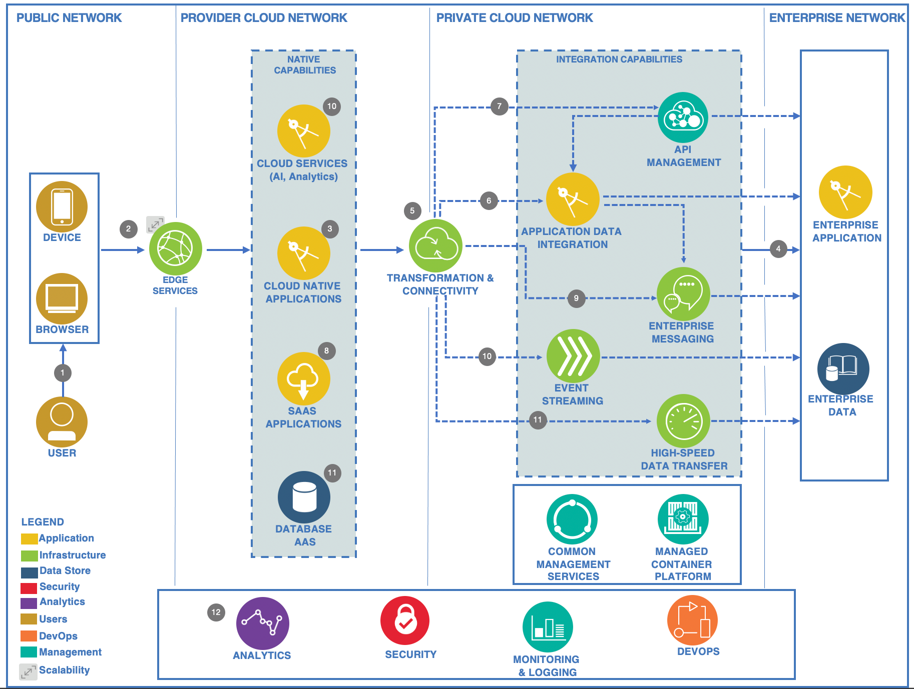

# Reference Architecture

## Cloud Application Integration Reference Architecture

The Cloud Reference Architecture explores common patterns in enterprises and hybrid cloud environments. The distributed component-based architecture supports lightweight fine-grained integration services to enable microservices and on-demand runtime application-level composition and aggregation.

