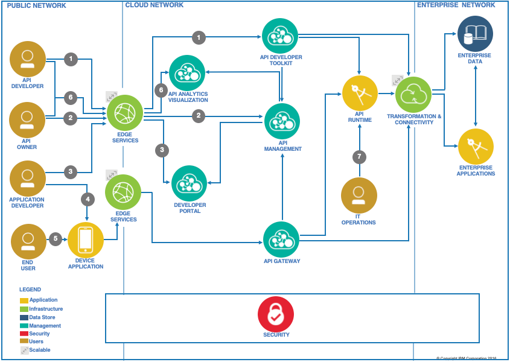
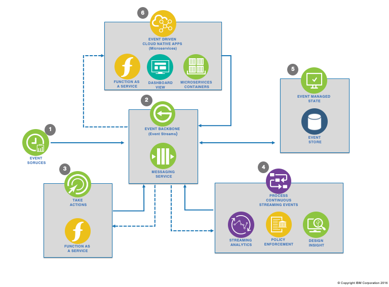

# IBM CP4I Capabilites
## IBM Cloud Pak for Integration: Capabilities

IBM Cloud Pak® for Integration offers a single, unified platform for all enterprise integration needs. It deploys integration capabilities into the Red Hat® OpenShift® managed container environment. IBM Cloud Pak for Integration uses the monitoring, logging, and security systems of Red Hat OpenShift to ensure consistency across all integration solutions.

The IBM Cloud Pak® for Integration platform provides a unified framework for security, management operations, and resiliency. The managed container platform of a private cloud provides resiliency through the elasticity of container clusters and platform-level security. The unified management component provides ease of operations with a single view across all integration components within the platform. The gateway services provide runtime-level security and enforce access control policies to integration services.

## API Economy

API adoption requires a capable API management platform, which provides enablers for an organization's API strategy throughout the entire API lifecycle. The platform includes capabilities for creating APIs, managing and securing them, and providing the runtime that hosts them. The API management platform consists of key components that provide needed capabilities. Those components are offered in a range of different deployment options to suit every organization's needs and environment along with underlying nonfunctional requirements.

The API lifecycle management reference architecture bridges the gap between cloud and on-premises applications quickly and easily. It allows customers to securely unlock IT assets and to deliver innovative applications with modern architectures.

## Event-driven

Event-driven architecture is a new addition to the publish/subscribe model for integration in the cloud. It uses event-streaming technologies to connect both cloud and on-premises workloads with cloud services and SaaS offerings, especially in AI and analytics.

In the IBM Event-driven reference architecture, an event backbone provides the connectivity between the components, which include event sources, event streams, streaming analytics, and microservices.

